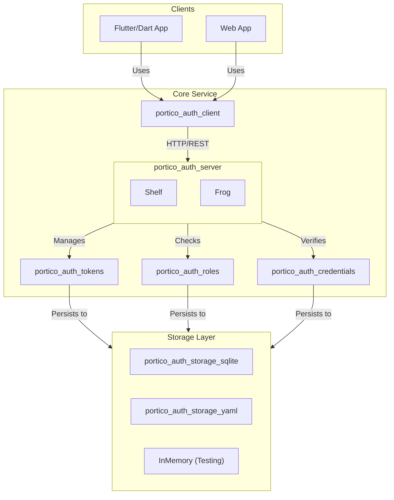

# Portico Auth Service

**A modular, Dart-native authentication and authorization ecosystem designed for self-hosting and simplicity.**

> "Portic-oh-auth"

---

## Why Portico Auth?

Portico Auth exists to solve a specific problem: **providing a lightweight, easy-to-deploy authentication solution for home labs, hobby projects, and simple applications.**

While heavy-hitters like Firebase, Auth0, and AWS Cognito are excellent for large-scale enterprise production, they can be overkill (and expensive) for smaller, self-hosted environments. Portico gives you ownership of your data and a simple, understandable architecture without the vendor lock-in.

> **Note:** For high-scale, mission-critical enterprise applications requiring advanced compliance (SOC2, HIPAA) or global edge replication, managed services like Firebase or Auth0 are recommended.

## Architecture & Packages

Portico is built as a modular monorepo, but you can pick and choose exactly what you need.

### Key Packages

| Package | Description |
| :--- | :--- |
| **[portico_auth_client](./packages/portico_auth_client)** | High-level Dart client for interacting with the auth server. Handles token refresh automatically. |
| **[portico_auth_server_shelf](./packages/portico_auth_server_shelf)** | Ready-to-use Shelf handlers and middleware for building your auth backend. |
| **[portico_auth_server_frog](./packages/portico_auth_server_frog)** | Dart Frog integration for a modern, provider-based backend experience. |
| **[portico_auth_tokens](./packages/portico_auth_tokens)** | The cryptographic core. Handles JWT minting, JWE encryption, and token rotation. |
| **[portico_auth_roles](./packages/portico_auth_roles)** | Flexible Role-Based Access Control (RBAC) supporting global and scoped permissions. |
| **[portico_auth_credentials](./packages/portico_auth_credentials)** | Secure password hashing (Argon2id) and user identity management. |

## Tech Stack

Built 100% in Dart, leveraging the robust ecosystem:

-   **Language:** Dart 3.10+
-   **Crypto:** `cryptography` (Argon2id)
-   **Tokens:** `jose_plus` (JWT/JWE)
-   **Server:** `shelf`, `dart_frog`
-   **Database:** `sqflite_common_ffi` (SQLite), `yaml` (File-based)

## Web Simulator

Want to see it in action without writing a single line of code?

Check out the **[Interactive Web Simulator](https://jtmcdole.github.io/auth_simulator)**. It runs the entire stack (Client, Server, Storage) directly in your browser, visualizing the network traffic and internal state changes in real-time.

## Getting Started

1.  **Choose your Server:** Decide between `shelf`, `frog`, or roll your own.
2.  **Choose your Storage:** Pick `sqlite` for robustness or `yaml` for human-readability.
3.  **Deploy:** Run your Dart server and connect your client app.

See the `example/` folders in each package for detailed usage guides.
